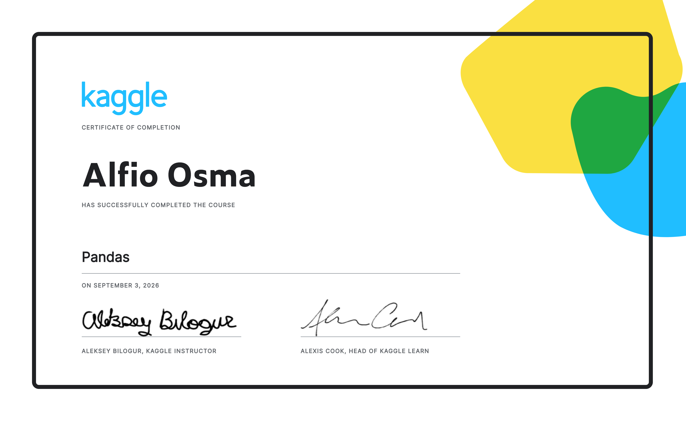

<div align="center">

```
  ╔══════════════════════════════════════════════════════════╗
  ║  BTC/USDT  |  ADX: 32.4  |  ATR: 1,240  |  POS: LONG   ║
  ║  Entry: 61,240  |  SL: 59,890  |  Status: ██████ LIVE  ║
  ╚══════════════════════════════════════════════════════════╝
```

# Alfio Osma
### Python Developer · Quantitative Finance · Algorithmic Trading

*"The stock market is a device for transferring money from the impatient to the patient." — Benjamin Graham*

[](https://www.linkedin.com/in/alfio32osma/)
[](https://mail.google.com/mail/?view=cm&fs=1&to=alfio32osma@gmail.com)
[](https://github.com/alfio32osma/alfio32osma/blob/main/kaggle-pandas-certificate.png)
[](https://github.com/alfio32osma/alfio32osma/blob/main/CS50P-CERTIFICATE.pdf)

</div>

---

## What I build

I develop **quantitative tools and algorithmic trading systems** that combine financial theory with Python. My focus is on systematic approaches to markets — not guesswork, but models grounded in data.

Currently working on two projects simultaneously:

**[▶ BTC/USDT Algorithmic Trading Bot](https://github.com/alfio32osma/backtest-btc-trading-bot)** — Live on Hyperliquid. Modular architecture with signal generation (ADX + ATR), dynamic stop loss, kill switch, and smart API caching. Backtesting engine fully refactored and published.

**[▶ Graham Intrinsic Value Calculator](https://github.com/alfio32osma/graham-financial-analysis)** — CS50P final project. Fetches real-time AAA corporate bond data from the Federal Reserve (FRED API) to compute intrinsic value using a modernised Graham formula. Includes pytest suite with API mocking.

---

## Stack

```python
languages  = ["Python", "C"]          # C via 42 Málaga network
tools      = ["Git", "pytest", "requests", "Pandas"]
markets    = ["Crypto perpetual futures", "Equity valuation", "DeFi / AMM"]
methods    = ["Algorithmic trading", "Backtesting", "Value investing"]
learning   = ["Quantitative finance", "Statistical methods", "NumPy"]
```
---

## Certifications




---
---

## Background

I come from an unusual combination: **9 years running a hospitality business** (La Frontera Playa, Málaga) with annual revenue tracked, accounted, and declared — including a peak month of €200k — while independently studying financial theory, value investing, and eventually, code.

That means I bring something most junior developers don't: I understand **why** the numbers matter, not just how to compute them.

Formal credentials:
- 📜 **CS50P** — Harvard University (completed, certificate published)
- 📜 **42 Málaga** — La Piscine (passed selection, C programming)
- 📜 **Kaggle — Pandas** — Certificate of Completion (Sept 2026)
- 📜 **Higher Degree — Business Administration & Finance** · GPA 8.08/10
- 📜 Work placement at **Reding Auditores S.L.** (auditing & consultancy) · Letter of commendation

---

## How I work

I use AI as a precision tool — not to generate code blindly, but to iterate faster on architecture decisions, edge case handling, and test coverage. Every module I ship, I can explain line by line. The refactoring and modularisation process is how I internalise what the system is doing.

This is the workflow I apply to every project:

```
Define the problem clearly →
Design the architecture →
Implement with AI assistance →
Refactor for readability →
Write pytest coverage →
Fix bugs against real market data →
Document for the next person
```

---

## What I'm looking for

My passion and long-term goal is to work at the intersection of **quantitative finance and code** — systematic trading, financial data analysis, or quant development in a high-level environment (Switzerland, major financial hubs). That's the direction I'm building toward.

At the same time, I'm realistic about where I am in the journey. I'm actively open to **junior software development roles** — in Python, backend, or data — that put me inside a high-quality engineering environment where I can grow fast, contribute from day one, and keep moving toward that objective.

What matters to me in a first role: technical rigour, a team I can learn from, and work that has real-world impact. The sector is secondary to the quality of the environment.

Not looking for general web development or roles disconnected from data, systems, or financial logic.

Open to remote or relocation — Switzerland, Ireland, or other European hubs.

---

<div align="center">

*Open to opportunities · Málaga, Spain · Open to relocation Switzerland | Ireland*

**[LinkedIn](https://www.linkedin.com/in/alfio32osma/) · <a href="mailto:alfio32osma@gmail.com">alfio32osma@gmail.com</a>**

<sub>Last updated: August 2026</sub>

</div>
